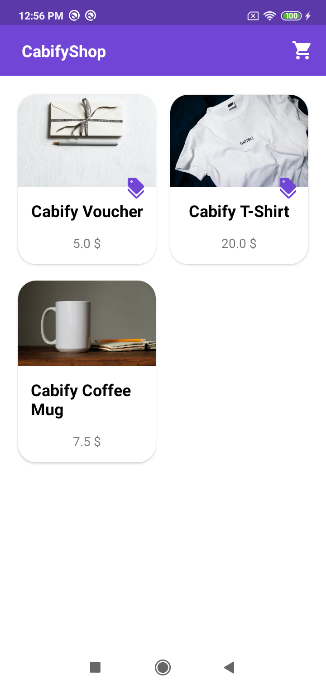
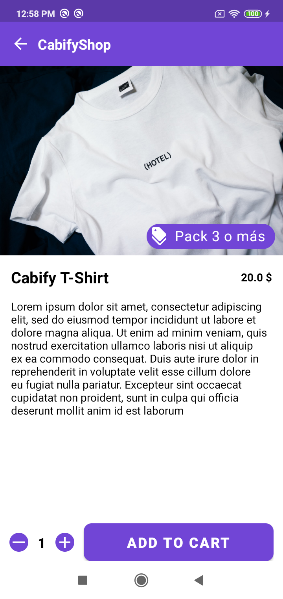
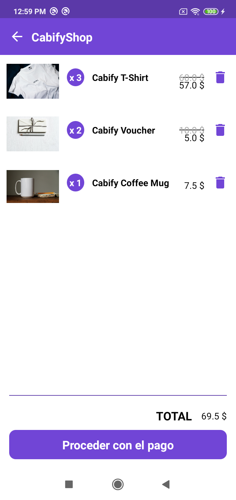

# CabifyShop

CabifyShop is an app that let the user buy items directly from the application enjoying multiple discounts.

It consists in three different views.

1. **Store** -> It will be the main view and the user could check all the items listed and which items has discounts.

2. **Detail** -> It shows the product details as well as the discounts and the option to add items to the shopping cart.

3. **Checkout** -> The final step before proceeding with the payment. Shows all the items added and those items that has discounts, it will show the original price and also
the price after discount applied.

## ARCHITECTURE

The architecture is based on MVI, using the state classes as the single source of truth.

The project is divided in different modules:

1. app -> Only contains the Application class to initialize Koin and all the modules.

2. components -> this module contains all the custom views used in the app.

3. -> core -> It contains all the logic and dependencies that will be required for the rest of the app. All the rest of modules will be dependant of this module.

4. ft-store -> Module that holds the logic for the store feature (the main view with all the items and the details)

5. ft-checkout -> Module that contains all the logic for the payment process.

6. navigator -> Module that contains the navigation between different modules. Each module will have the interface declaring the navigation and this module holds the implementation.
 This module will be at the same level as core module so it knows about every module in the app.

 7. resources -> The intention of that module is to make app module even easier and to holds all the resources that will be used for the entire app. All the rest of resources used only by a specific module, will be stored in that module.

## GRADLE

The gradle files are structured in the following way

**base.gradle** Contains all the common logic for all the modules. Each module will implement orr manage dependencies as it needs.

**dependencies.gradle** -> It contains all the dependencies used in this project

## LIBRARIES USED

### Storage

- [JetPack DataStore](https://developer.android.com/topic/libraries/architecture/datastore?gclid=Cj0KCQjwjvaYBhDlARIsAO8PkE3d_r8Vqt6QMHbUVloXAcexqAx5fvQY84OSW6Rh-2ZsRfm8miDGl88aAtgGEALw_wcB&gclsrc=aw.ds) -> It lets to save data locally and manage in an asynchronous way. I have used Proto DataStore because it is type safe.
I could have used Room or [Preferences DataStore](https://developer.android.com/jetpack/androidx/releases/datastore?hl=es-419#preferences-datastore-dependencies) but I'd preferred to investigate this library (I haven't used before)

### Basic

- [JetPack Navigation](https://developer.android.com/guide/navigation) -> To manage all the navigation between features and also navigation inside modules.

- [Moshi](https://github.com/square/moshi) -> JSON parser

- [Kotlin Coroutines](https://developer.android.com/kotlin/coroutines?gclid=Cj0KCQjwjvaYBhDlARIsAO8PkE0nwKJG8Fi5ksddI5GwB5Vw6gjui_Iim4SsbkTaCHwRqQgRhb89FN4aAssjEALw_wcB&gclsrc=aw.ds)

- [Kotlin flows](https://developer.android.com/kotlin/flow) -> It's used in JetPack Proto DataStore and I would love to migrate the project to use Flows and StateFlow instead of LiveData (running out of time)

- [Koin](https://insert-koin.io/) for di

### Testing

- [JUnit 5](https://junit.org/junit5/docs/current/user-guide/) and [Mockito](https://site.mockito.org/)

## Future work

- Add JetPack Compose (I haven't used it because I don't have enough knowledge to implement it but still learning).
- Use ListAdapter and DiffUtils.
- Add UI testing.
- Use Kotlin DSL for gradle files.

Hope you like my solution and I would really appreciate your comments to improve it!
